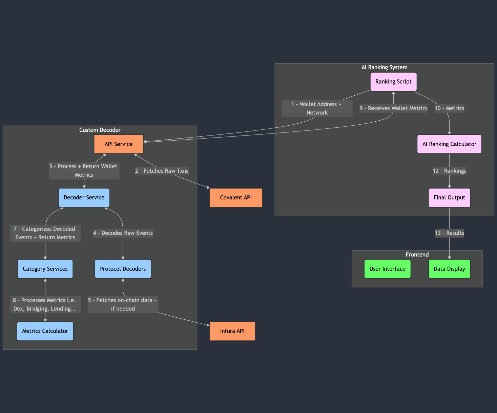

# BonusBlock

## System Architecture and Data Flow

### Overview

The system consists of two main components that work together to analyze and rank wallet behavior on blockchain networks:

1. **Custom Decoder**
2. **AI Ranking System**

<div align="center">
      
</div>

### Component Breakdown and Data Flow

#### Initial Request Flow

1. The process begins when the AI Ranking System sends a wallet analysis request:
    - **Ranking Script** initiates the process by sending:
        - Wallet address
        - Network identifier (e.g., eth-mainnet, arbitrum, etc.)
    - This request is received by the API Service in the Custom GoldRush Decoder

#### Data Collection Phase

2. The API Service performs two critical operations:
    - **Connects to Covalent API** to fetch:
        - All historical transactions for the wallet
        - Associated event logs
        - Token balances and metadata
    - **Formats and prepares** the raw data for decoding

#### Decoding Phase

3. The Decoder Service processes the raw transaction data:
    - Receives formatted transaction data from the API Service
    - Routes transactions to appropriate Protocol Decoders
    - Protocol Decoders may fetch additional data from Infura API when needed:
        - Smart contract state data
        - Token information
        - Protocol-specific data

#### Categorization Phase

4. Once decoded, the events go through categorization:
    - **Category Services** classifies events into categories:
        - DEX interactions
        - Lending activities
        - Bridging operations
        - Staking events
        - And other protocol-specific categories
    - **Metrics Calculator** processes each category:
        - Calculates volume metrics
        - Determines usage patterns
        - Aggregates protocol interactions
        - Computes category-specific metrics

#### AI Ranking Phase

5. The processed data flows back to the AI Ranking System:
    - Ranking Script receives structured metrics
    - AI Ranking Calculator processes metrics to determine wallet ranking
    - Final Output generates:
        - Wallet rankings per metric

### Data Dependencies

#### External API Dependencies

1. **Covalent API**

    - Primary source for historical transaction data
    - Provides token balances and metadata
    - Offers cross-chain data access

2. **Infura API**
    - Used for real-time blockchain queries
    - Provides specific contract state data
    - Supports protocol-specific data needs

#### Internal Data Flow

1. Raw Transaction Data → Decoded Events
2. Decoded Events → Categorized Activities
3. Categorized Activities → Calculated Metrics
4. Calculated Metrics → AI Rankings
5. AI Rankings → User Interface

### System Interactions

#### Sequential Processing

1. Data collection → Decoding → Categorization → Metrics
    - Each step depends on the completion of the previous step

#### Parallel Processing

2. Multiple protocol decoders can run simultaneously
    - Category processing occurs in parallel
    - Metric calculations run concurrently for different categories

#### Asynchronous Operations

3. External API calls are handled asynchronously
    - Protocol decoders operate independently
    - Metric calculations run in parallel when possible

## Forked Decoder Documentation

The **GoldRush Decoder** contains the logic for decoding a `raw_log_event` of a transaction into meaningful, human-readable, structured data. so the by forking we're able to add categorization

### Knowledge Primer

#### Config

1. A `config` is a mapping of a contract address, chain name, and protocol name to create a unique configuration for every protocol across all the chains for all the contracts. A protocol can have a collection of configs in an array:

```typescript
export type Configs = {
    protocol_name: string;
    chain_name: Chain;
    address: string;
    is_factory: boolean;
}[];
```

#### GoldRushDecoder

2. The `GoldRushDecoder` class has different methods that enable the decoding logic to run:

    1. **initDecoder**: Scans the `./services/decoder/protocols` directory for all the protocols, extracts the `configs` from them, and creates a mapping to the respective decoding function. It is run when the server starts.

    2. **on**: Creates a decoding function for the specified protocol name on the specified chains:

```typescript
GoldRushDecoder.on(
    "<protocol-name>:<EventName>",
    ["<chain_name_1>", "<chain_name_2>"],
    ABI as Abi,
    async (log_event, tx, chain_name, covalent_client): Promise<EventType> => {
        // decoding logic
    }
);
```

-   **Arguments**:

    -   `Event Id`: A case-sensitive string concatenation of the `protocol name` with the `event name` by a `:`.
    -   `Chain Names`: An array of all the chains the defined decoding function will run for.
    -   `ABI`: The ABI of the contract on which the event exists.
    -   `Decoding Function`: The actual decoding function with arguments:
        -   `log_event`: The raw log event that is being decoded.
        -   `tx`: The transaction object that generated this log.
        -   `chain_name`: Name of the chain to which the log belongs.
        -   `covalent_client`: The Covalent client created with your Covalent API key.

    3. **fallback**: Creates a fallback function for the specified event name:

```typescript
GoldRushDecoder.fallback(
    "EventName",
    ABI as Abi,
    async (log_event, tx, chain_name, covalent_client): Promise<EventType> => {
        // decoding logic
    }
);
```

    4. **decode**: The function that chooses which decoding function needs to be called for each log event. It collects all the decoded events for a transaction and returns them in an array of structured data.

### Running the Development Server

1. Install the dependencies:

```bash
yarn install
```

2. Setup the environmental variables. Refer to `.env.example` for the list of environmental variables and store them in `.env` at the root level of the repository.

3. Start the server:

```bash
yarn dev
```

The development server will start on the URL `http://localhost:8080` (port number may change based on the `.env`, 8080 is default).

### API Endpoints

#### Transaction Decoder

1. The default endpoint for the v1 of the server. Covalent API key is **mandatory** for the Decoder to work.

-   **Endpoint**: `/api/v1/tx/decode`
-   **Expects JSON Body**:
    -   `chain_name`: The chain name of the transaction
    -   `tx_hash`: Hash of the transaction to be decoded

```bash
curl --location 'http://localhost:<PORT>/api/v1/tx/decode' \
--header 'x-covalent-api-key: <COVALENT_API_KEY>' \
--header 'Content-Type: application/json' \
--data '{
  "chain_name": "<CHAIN_NAME>",
  "tx_hash": "<TX_HASH>"
}'
```

#### Wallet Decoder

2. **Endpoint**: `/api/v1/wallet/decode`

-   **Expects JSON Body**:
    -   `chain_name`: The chain name of the transaction
    -   `wallet_address`: Wallet address to be decoded

```bash
curl --location 'http://localhost:<PORT>/api/v1/wallet/decode' \
--header 'x-covalent-api-key: <COVALENT_API_KEY>' \
--header 'Content-Type: application/json' \
--data '{
  "chain_name": "<CHAIN_NAME>",
  "wallet_address": "<WALLET_ADDRESS>"
}'
```

#### Categorized Wallet Analysis

3. **Endpoint**: `/api/v1/wallet/categorize/decode`

-   **Expects JSON Body**:
    -   `chain_name`: The chain name of the transaction
    -   `wallet_address`: Wallet address to be decoded

```bash
curl --location 'http://localhost:<PORT>/api/v1/wallet/categorize/decode' \
--header 'x-covalent-api-key: <COVALENT_API_KEY>' \
--header 'Content-Type: application/json' \
--data '{
  "chain_name": "<CHAIN_NAME>",
  "wallet_address": "<WALLET_ADDRESS>"
}'
```

### Adding a Decoder

1. Run this on your terminal:

```bash
yarn add-config
```

2. Add a Protocol Name for which you want to add a config. If the protocol does not exist, a new protocol will be created. If it exists, another config will be added for that protocol.

3. Input data as per the prompts:
    - `address`: The contract address (standalone or factory contract)
    - `is_factory`: Whether the input address is a factory contract
    - `chain_name`: The chain for which the config is added

This will modify configs in the `Protocols` folder. A config will be added to `${protocol_name}.configs.ts`. A sample decoder with a dummy event name will be added to `${protocol_name}.decoders.ts`. A test file `${protocol_name}.test.ts` will also be created.

In `${protocol_name}.decoders.ts`, implement the decoding logic. The return type expects:

```typescript
export interface EventType {
    category: DECODED_EVENT_CATEGORY;
    action: DECODED_ACTION;
    name: string;
    protocol?: {
        name: string;
        logo: string;
    };
    tokens?: {
        heading: string;
        value: string;
        decimals: number;
        ticker_symbol: string | null;
        ticker_logo: string | null;
        pretty: string;
    }[];
    nfts?: {
        heading: string;
        collection_name: string | null;
        token_identifier: string | null;
        collection_address: string;
        images: {
            default: string | null;
            256: string | null;
            512: string | null;
            1024: string | null;
        };
    }[];
    details?: {
        heading: string;
        value: string;
        type: "address" | "text";
    }[];
}

export enum DECODED_EVENT_CATEGORY {
    NFT = "NFT Transaction",
    LENDING = "Lending",
    SAFE = "SAFE",
    DEX = "DEX",
    TOKEN = "Token",
    SYNTHTIC = "Synthtic",
    MARGIN = "Margin",
    VAULT = "Vault",
    METAVERSE = "Metaverse",
    SWAP = "Swap",
    DEFI = "DeFi",
    BRIDGE = "Bridge",
    GAMING = "Gaming",
    SOCIAL = "Social",
    STAKING = "Staking",
    PERPETUAL = "Perpetual",
    OTHERS = "Others",
}

export enum DECODED_ACTION {
    SWAPPED = "Swapped",
    MULTISIG_ACTION = "MultiSig",
    APPROVAL = "Approval",
    TRANSFERRED = "Transferred",
    TRANSFERRED_SHARE = "Transferred Shares",
    NATIVE_TRANSFER = "Native Token Transfer",
    RECEIVED_BRIDGE = "Received Bridge",
    ACCOUNT_ABSTRACTION = "Account Abstraction Transaction",
    SALE = "Sale",
    MINT = "Mint",
    BURN = "Burn",
    COLLECT = "Collect",
    WITHDRAW = "Withdraw",
    WITHDRAW_COMPLETED = "Withdraw Completed",
    WITHDRAW_QUEUED = "Withdraw Queued",
    WITHDRAW_REQUEST = "Withdraw Requested",
    DEPOSIT = "Deposit",
    SUPPLY = "Supply",
    ADD_LIQUIDITY = "Add Liquidity",
    REMOVE_LIQUIDITY = "Remove Liquidity",
    UPDATE = "Update",
    FLASHLOAN = "Flashloan",
    REPAY = "Repay",
    BORROW = "Borrow",
    LIQUIDATE = "Liquidate",
    CLAIM_REWARDS = "Claim Rewards",
    GAME_ACTION = "Game Action",
    CREATE = "Create Pool",
    INIT_ROUTER = "Init Router",
    ADD_ROUTER = "Add Router",
    REMOVE_ROUTER = "Remove Router",
}
```
